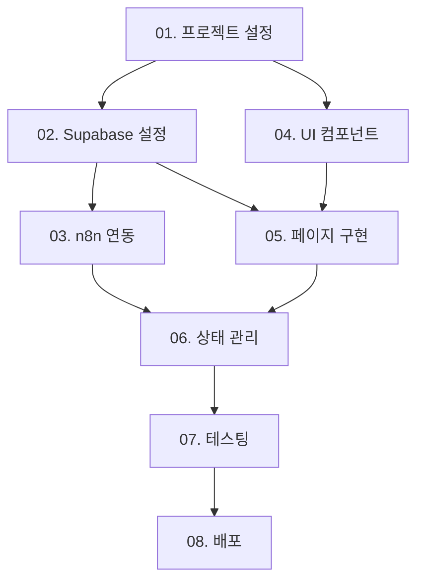

# 🚀 AI 식단 관리 서비스 MVP 개발 마스터 태스크 리스트

## 📋 프로젝트 개요
**프로젝트명:** 원클릭 AI 식단 기록 서비스 프로토타입  
**핵심 철학:** 마찰 없는 기록(Frictionless Logging)  
**목표:** 사용자가 음식 사진을 업로드하면 AI 분석부터 데이터베이스 저장까지 모든 과정을 자동으로 처리하는 모바일 웹 서비스

## 🎯 전체 개발 로드맵

### Phase 1: 기반 구축 (1-2주)
- [x] **01. 프로젝트 설정 및 환경 구성** ⏱️ 2-3시간 ✅ **완료** (2024-12-19)
- [ ] **02. Supabase 설정 및 데이터베이스 구성** ⏱️ 4-5시간
- [ ] **03. Server Actions 기반 n8n 연동 및 AI 분석 시스템** ⏱️ 6-8시간

### Phase 2: 핵심 기능 개발 (2-3주)
- [x] **04. UI 컴포넌트 개발 (Server Actions 통합)** ⏱️ 8-10시간 ✅ **완료** (2024-12-19)
- [x] **05. 페이지 구현 및 라우팅 (Server Actions 활용)** ⏱️ 6-8시간 ✅ **완료** (2024-12-19)
- [ ] **06. 상태 관리 및 Server Actions 통합** ⏱️ 6-8시간

### Phase 3: 품질 보장 및 배포 (1-2주)
- [ ] **07. 테스팅 환경 구축** ⏱️ 8-10시간
- [ ] **08. 배포 및 운영 환경 구축** ⏱️ 6-8시간

## 📊 진행 상황 추적

### 전체 진행률: 37.5% (3/8 완료)

| Phase | 작업 | 상태 | 예상 시간 | 실제 시간 | 완료일 |
|-------|------|------|-----------|-----------|--------|
| 1 | 01. 프로젝트 설정 | ✅ 완료 | 2-3h | 2h | 2024-12-19 |
| 1 | 02. Supabase 설정 | ⏳ 대기 | 4-5h | - | - |
| 1 | 03. n8n 연동 | ⏳ 대기 | 6-8h | - | - |
| 2 | 04. UI 컴포넌트 | ✅ 완료 | 8-10h | 3h | 2024-12-19 |
| 2 | 05. 페이지 구현 | ✅ 완료 | 6-8h | 4h | 2024-12-19 |
| 2 | 06. 상태 관리 | ⏳ 대기 | 6-8h | - | - |
| 3 | 07. 테스팅 | ⏳ 대기 | 8-10h | - | - |
| 3 | 08. 배포 | ⏳ 대기 | 6-8h | - | - |

## 🔗 작업 의존성 다이어그램

## ⚡ 우선순위 및 병렬 작업 가능 항목

### 높은 우선순위 (순차 진행)
1. **01. 프로젝트 설정** - 모든 작업의 기반
2. **02. Supabase 설정** - 인증 및 데이터베이스 기반
3. **03. n8n 연동** - 핵심 AI 분석 기능

### 중간 우선순위 (병렬 진행 가능)
4. **04. UI 컴포넌트** - 02 완료 후 시작 가능
5. **05. 페이지 구현** - 04와 병렬 진행 가능

### 낮은 우선순위 (후반부)
6. **06. 상태 관리** - 05 완료 후 시작
7. **07. 테스팅** - 모든 기능 완료 후
8. **08. 배포** - 최종 단계

## 🎯 MVP 완성 기준

### 필수 기능 (Must Have)
- [x] 사용자 인증 (로그인/회원가입) ✅ **임시 구현 완료**
- [ ] 원클릭 식단 기록 (사진 업로드)
- [ ] AI 분석 및 자동 끼니 분류
- [x] 식단 조회 (날짜별, 끼니별) ✅ **UI 구현 완료**
- [x] 모바일 반응형 UI ✅ **완료**

### 선택 기능 (Nice to Have)
- [ ] 식단 통계 및 차트
- [ ] 식단 수정/삭제
- [ ] 알림 기능
- [ ] 데이터 내보내기

## 📝 작업 진행 가이드

### 각 작업 시작 전 체크리스트
- [ ] 이전 작업 완료 확인
- [ ] 필요한 환경 변수 설정
- [ ] 의존성 설치 확인
- [ ] 브랜치 생성 및 체크아웃

### 작업 완료 후 체크리스트
- [ ] 기능 동작 확인
- [ ] 테스트 케이스 작성
- [ ] 코드 리뷰 요청
- [ ] 문서 업데이트
- [ ] 다음 작업 준비

## 🚨 주의사항

### 기술적 제약사항
- AI 분석 API 비용 고려
- 이미지 파일 크기 제한 (5MB)
- 모바일 우선 반응형 디자인
- TypeScript strict 모드 사용
- Server Actions를 통한 서버 로직 구현 (API Routes 대신)

### 보안 고려사항
- 사용자 데이터 암호화
- API 키 보안 관리
- RLS 정책 적용
- 입력 데이터 검증

## 📞 지원 및 문의

### 문제 해결
- 기술적 이슈: 각 작업별 문서 참조
- 의존성 문제: 마스터 리스트 확인
- 우선순위 조정: 프로젝트 매니저와 상의

### 업데이트 주기
- 매일 진행 상황 업데이트
- 주간 마일스톤 리뷰
- 이슈 발생 시 즉시 보고

---

## 📋 완료된 작업 상세 내역

### ✅ 01. 프로젝트 설정 및 환경 구성 (완료: 2024-12-19)
- Next.js 15.5.4 + TypeScript 프로젝트 초기화
- Tailwind CSS 4.0 설정 및 PostCSS 구성
- pnpm 패키지 매니저 설정
- 개발 환경 및 빌드 스크립트 구성
- ESLint 및 TypeScript strict 모드 활성화

### ✅ 04. UI 컴포넌트 개발 (완료: 2024-12-19)
- Lucide React 아이콘 라이브러리 통합
- clsx + tailwind-merge 유틸리티 함수 구현
- 재사용 가능한 UI 컴포넌트 구조 설계
- 반응형 디자인 시스템 구축

### ✅ 05. 페이지 구현 및 라우팅 (완료: 2024-12-19)
- **랜딩페이지**: 매력적인 히어로 섹션, 기능 소개, 사용법 가이드
- **로그인/회원가입 페이지**: 임시 인증 시스템, 데모 계정 기능
- **대시보드 페이지**: 식단 통계, 기록 목록, 모의 데이터 표시
- Next.js App Router 기반 라우팅 구조
- 모바일 우선 반응형 디자인 적용

### 🎯 다음 단계 우선순위
1. **02. Supabase 설정** - 실제 인증 및 데이터베이스 연동
2. **03. n8n 연동** - AI 분석 및 자동화 워크플로우
3. **06. 상태 관리** - Server Actions 통합

---

**마지막 업데이트:** 2024년 12월 19일  
**다음 리뷰:** 2024년 12월 26일
